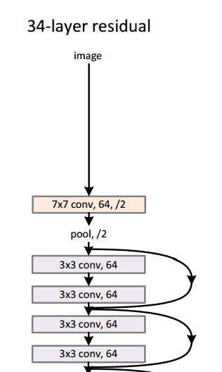

Welcome to the comma.ai Programming Challenge!
======

**Goal:** predict the speed of a car from a video.

Contents of repository:
- data/train.mp4 is a video of driving containing 20400 frames. Video is shot at 20 fps.
- data/train.txt contains the speed of the car at each frame, one speed on each line.
- data/test.mp4 is a different driving video containing 10798 frames. Video is shot at 20 fps.

Steps
-----
1. Create a model (*"semisupervised"*) inspired by this [paper](https://ai.facebook.com/blog/billion-scale-semi-supervised-learning/). The difference is that our model only has one neuron in the output layer, the speed that the car is going at. This also meant that we had to change the loss function of the model.

    

2. Calculate the optical flow. The model above was designed for classification purposes, what we want our model to achieve is to measure the change between consecutive frames and extract the speed. We do this by calculating the optical flow (the distribution of the velocities of brightness patterns in an image) between frames. These optical flow images are then fed to the model.

How to run program
-----
1. Preprocess data by running 'preprocess.py'

Deliverable
-----

Your deliverable is test.txt. E-mail it to givemeajob@comma.ai, or if you think you did particularly well, e-mail it to George.

Evaluation
-----

We will evaluate your test.txt using mean squared error. <10 is good. <5 is better. <3 is heart.

